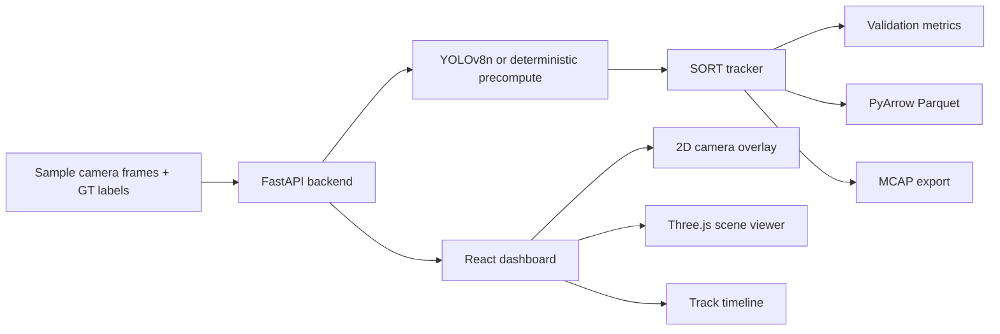

# PerceptionViz Replay Architecture

PerceptionViz Replay is a two-service web application. The FastAPI backend owns dataset loading, optional YOLOv8n inference, precomputed detection loading, SORT-style tracking, metric aggregation, Parquet persistence, and MCAP export. The React frontend owns frame replay, 2D and 3D visualization, per-frame inspection, track timeline analysis, and metric exploration.

The default runtime path uses precomputed detections to keep Railway page loads quick. The `POST /detect/{frame_id}` endpoint remains available to run frame-level inference behavior from the dashboard.
